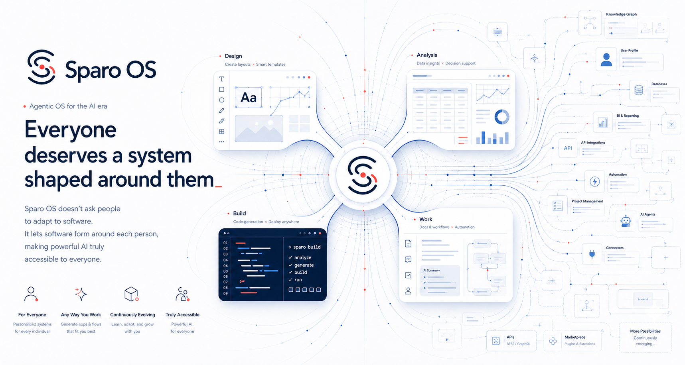

[中文](README.zh-CN.md) | **English**

<div align="center">



</div>
<div align="center">

[](https://github.com/GCWing/Sparo-Agentic-OS/releases)
[](https://github.com/GCWing/Sparo-Agentic-OS/actions/workflows/ci.yml)
[](https://github.com/GCWing/Sparo-Agentic-OS/blob/main/LICENSE)
[](https://github.com/GCWing/Sparo-Agentic-OS)
[](https://tauri.app/)

</div>

---

> The core kernel of this project comes from [GCWing/BitFun](https://github.com/GCWing/BitFun).

## Introduction

Sparo OS is an Agentic OS built for the AI era. It hosts the scheduling and continuous runtime of all kinds of **intelligent applications**, with **desktop support across Windows, macOS, and Linux**.

You do not need to care about underlying structures such as sessions, workspaces, or context, so what you see is just a single conversation box, with almost zero barrier to getting started. It can help you write code, do design work, collaborate on office tasks, and operate your computer...

You only need to state what you want. Whether you start directly from the **desktop app** or direct it remotely through your **phone or bots**, **Sparo OS organizes tasks, carries context forward, and keeps AI working continuously in the background, gradually adapting to your personal workflow**.

---

## Design Philosophy

Sparo OS is organized around **Agentic OS + Intelligent Apps**:

- **Agentic OS**: the unified operation layer that carries tasks, workspaces, sessions, toolchains, and remote entry points, turning AI from one-off replies into a continuously running work system.
- **Intelligent Apps (Agent App / Live App / Bridge App)**: first-class application forms that carry different capability shapes. They can be Agent apps with autonomous reasoning and execution, dynamically generated Live Apps that keep evolving, or Bridge Apps that work together with traditional GUI software.
- **Dev Kit**: built for intelligent app development, helping users build, debug, and extend their own apps based on capability components such as Skills, Tools, and MCP.
- **Unified scheduling and unified entry point**: users do not need to choose between abstract "modes"; they directly enter specific apps, tasks, and workflows inside one system.

## Intelligent Apps

Sparo OS's intelligent apps are first-class citizens of Agentic OS, all accessible and manageable from the unified **Apps** hub:


| Category       | Positioning                                    | Description                                                                                                                                                                                               |
| -------------- | ---------------------------------------------- | --------------------------------------------------------------------------------------------------------------------------------------------------------------------------------------------------------- |
| **Agent App**  | Autonomous execution-oriented intelligent apps | Composed of one or more Agents, using conversation and task flow as the main interaction model. Best suited for work scenarios that require continuous execution, heavy execution, and light interaction. |
| **Live App**   | Interactive generated applications             | Generated on demand by Agents with the interface and capabilities best suited to the user's workflow. They have persistent identity and state, and can continue evolving and being reused.                |
| **Bridge App** | Bridged applications for existing software     | Adds an operational Agent layer on top of existing GUI software, bringing legacy software into the Agentic OS workflow.                                                                                   |


Current built-in apps:


| App        | Positioning                  | Description                                                                                                                   |
| ---------- | ---------------------------- | ----------------------------------------------------------------------------------------------------------------------------- |
| **Code**   | For software development     | Built around Agentic, Plan, Debug, and Review workflows, covering implementation, planning, troubleshooting, and code review. |
| **Cowork** | For office collaboration     | Suitable for organizing requirements, drafting content, and advancing day-to-day tasks and knowledge work.                    |
| **Design** | For design exploration       | Used for HTML prototypes, visual artifacts, and design collaboration scenarios.                                               |


---

## Dev Kit

> It grows on its own.

Agentic OS comes with built-in scene-specific Tools and other capabilities for users to build their own intelligent apps. It also supports external Skills, MCP (including MCP Apps), and custom Sub Agents as kits for building intelligent apps.

---

## Platform Support

Built with Tauri, the project supports Windows, macOS, and Linux, while also supporting mobile control through the phone browser, Telegram, Feishu, WeChat, and more.

---

## Quick Start

### Download and use

Download the latest desktop installer from [Releases](https://github.com/GCWing/Sparo-Agentic-OS/releases). After installation, configure your model and start using it.

### Build from source

**Prerequisites:**

- [Node.js](https://nodejs.org/) (LTS recommended)
- [pnpm](https://pnpm.io/)
- [Rust toolchain](https://rustup.rs/)
- [Tauri prerequisites](https://v2.tauri.app/start/prerequisites/) (required for desktop development)

**Commands:**

```bash
# Install dependencies
pnpm install

# Run desktop in development mode
pnpm run desktop:dev

# Build desktop
pnpm run desktop:build
```

For more details, see the [Contributing guide](./CONTRIBUTING.md).

---

## Contributing

We welcome great ideas and code, and we are highly open to AI-generated code.

**Contribution directions we care about most:**

1. Good ideas / creativity (features, interaction, visuals, etc.)—via Issues
2. Improving the Agent system and outcomes
3. Improving stability and foundational capabilities
4. Growing the ecosystem (Skills, MCP, LSP plugins, or better support for certain vertical development scenarios)

---

## Disclaimer

1. This project is a spare-time exploration and research effort toward next-generation human-machine collaboration, and is not a commercial profit-making project.
2. More than 99% of this project was built with Vibe Coding. Code issues and suggestions are welcome, and AI-assisted refactoring and optimization are encouraged.
3. This project depends on and references many open-source projects. Thanks to all open-source authors. **If your rights are affected, please contact us and we will address it.**

---
