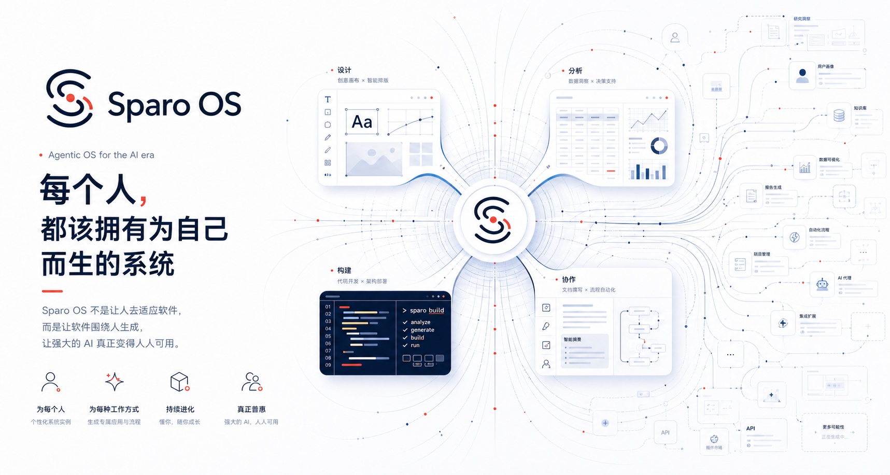

**中文**  | [English](README.md)

<div align="center">



</div>
<div align="center">

[](https://github.com/GCWing/Sparo-Agentic-OS/releases)
[](https://github.com/GCWing/Sparo-Agentic-OS/actions/workflows/ci.yml)
[](https://github.com/GCWing/Sparo-Agentic-OS/blob/main/LICENSE)
[](https://github.com/GCWing/Sparo-Agentic-OS)
[](https://tauri.app/)

</div>

---

> 本项目核心内核来自 [GCWing/BitFun](https://github.com/GCWing/BitFun)。

## 简介

Sparo OS 是面向AI时代打造的Agentic OS，承载各类**智能应用**调度和持续运行，支持 **Windows、macOS、Linux全平台桌面端**。

你不需要关心会话、工作区、上下文这些底层组织方式，所以在你面前只有一个对话框，几乎 0 门槛就能开始使用，它可以帮你写代码、做设计、办公协同、操作你的电脑...

你只需要提出需求，无论是在**桌面端**直接发起，还是通过**手机、机器人**等入口远程指挥，**Sparo OS 都会在背后组织任务、衔接上下文，并让 AI 持续工作、持续沉淀，逐步贴合你的个人流程**。

---

## 构建理念

Sparo OS 围绕 **Agentic OS + 智能应用** 来组织整个产品：

- **Agentic OS**：作为统一操作层，负责承载任务、工作区、会话、工具链与远程入口，让 AI 从一次性回答升级为可持续运行的工作系统。
- **智能应用（Agent App / Live App / Bridge App）**：作为一等公民应用承载不同能力形态。既可以是具备自主推理与执行能力的 Agent 应用，也可以是按需生成、可持续演化的灵动应用，或与传统 GUI 软件协同工作的桥接应用。
- **开发套件（Dev Kit）**：面向智能应用开发，帮助用户基于 Skills、Tools、MCP 等能力组件构建、调试并扩展自己的应用。
- **统一调度与统一入口**：用户不需要在“模式”里做选择，而是在同一系统里直接进入具体应用、具体任务和具体工作流。


## 智能应用

Sparo OS 的智能应用是 Agentic OS 的一等公民，全部可在统一的**应用中心**中访问和管理：


| 类别             | 定位        | 说明                                                |
| -------------- | --------- | ------------------------------------------------- |
| **Agent App**  | 自主执行型智能应用 | 由一个或多个 Agent 组成，以对话与任务流为主要交互载体，适合持续执行的重执行、轻交互的工作场景。 |
| **Live App**   | 可交互生成式应用  | 由 Agent 按需生成界面与能力，给用户最适合自己工作流的交互界面，具备持久身份和状态，可持续演化与复用。             |
| **Bridge App** | 传统软件桥接应用  | 在既有 GUI 软件之上叠加操作 Agent，让存量软件接入 Agentic OS 的工作流。   |


当前内置应用：


| 应用         | 定位     | 说明                                                  |
| ---------- | ------ | --------------------------------------------------- |
| **Code**   | 面向软件开发 | 由 Agentic、Plan、Debug、Review 等工作流组成，覆盖实现、规划、排障与代码审查。 |
| **Cowork** | 面向办公协作 | 适合整理需求、起草内容、推进日常事务与知识工作。                            |
| **Design** | 面向设计探索 | 用于 HTML 原型、视觉稿与设计协作场景。                              |


---

## 开发套件（Dev Kit）

> 它会自己成长。

Agentic OS内置了场景的Tools等提供给用户构建自己的智能应用，同时支持接入外部的Skill、MCP（包含 MCP App）、自定义Sub Agent等作为Kit来构建智能应用。

---

## 平台支持

项目采用tauri，支持Windows、macOS、Linux，同时支持移动控制手机浏览器、Telegram、飞书、微信等。

---

## 快速开始

### 直接下载使用

在 [Releases](https://github.com/GCWing/Sparo-Agentic-OS/releases) 页面下载最新桌面端安装包，安装后配置模型即可开始使用。

### 从源码构建

**前置依赖：**

- [Node.js](https://nodejs.org/)（推荐 LTS 版本）
- [pnpm](https://pnpm.io/)
- [Rust 工具链](https://rustup.rs/)
- [Tauri 前置依赖](https://v2.tauri.app/start/prerequisites/)（桌面端开发需要）

**运行指令：**

```bash
# 安装依赖
pnpm install

# 以开发模式运行桌面端
pnpm run desktop:dev

# 构建桌面端
pnpm run desktop:build
```

更多详情请参阅[贡献指南](./CONTRIBUTING_CN.md)。

---

## 贡献

欢迎大家贡献好的创意和代码，我们对 AI 生成代码抱有最大的接纳程度。

**我们重点关注的贡献方向：**

1. 贡献好的想法 / 创意（功能、交互、视觉等），提交 Issue
2. 优化 Agent 系统和效果
3. 提升系统稳定性和完善基础能力
4. 扩展生态（Skill、MCP、LSP 插件，或对某些垂域开发场景的更好支持）

---

## 声明

1. 本项目为业余时间探索、研究构建下一代人机协同交互，非商用盈利项目。
2. 本项目 99%+ 由 Vibe Coding 完成，代码问题也欢迎指正，可通过 AI 进行重构优化。
3. 本项目依赖和参考了众多开源软件，感谢所有开源作者。**如侵犯您的相关权益请联系我们整改。**

---

